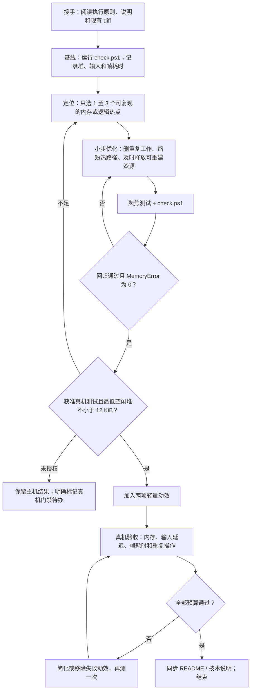
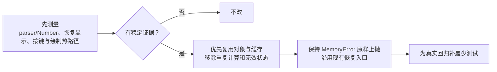
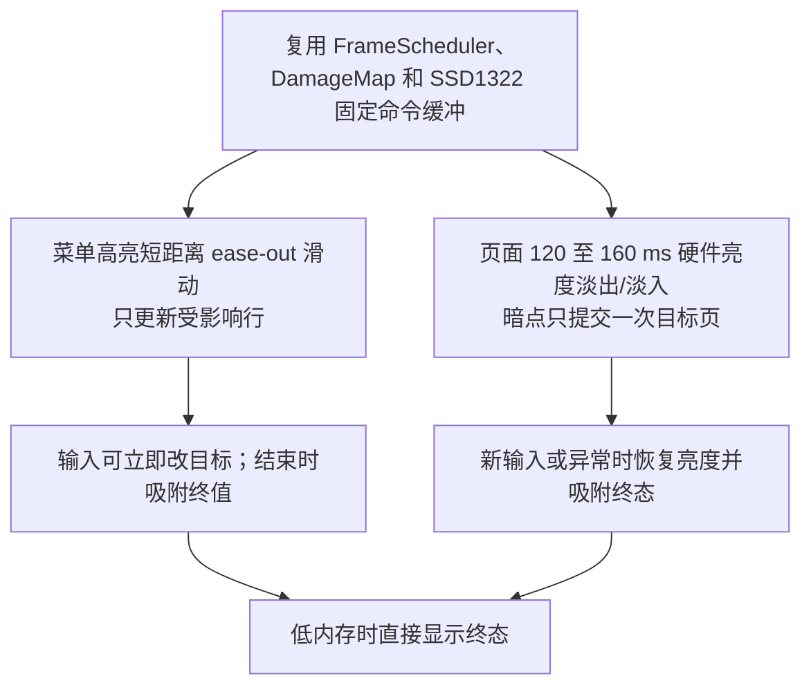
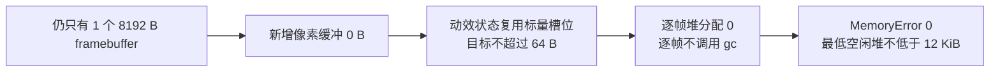
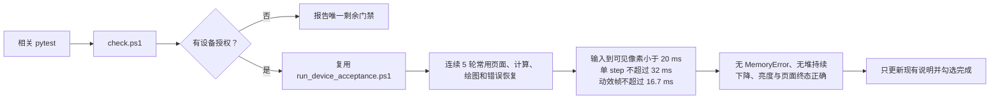

# SCI-CALC 简明优化计划

> 本文件是仓库唯一的执行计划。执行者必须先阅读并遵守
> [项目的执行原则](../项目的执行原则.md)，不要再创建 TODO 历史、架构审查报告或并行计划。

## 执行入口

- 项目结构与命令：[README](README.md)
- 技术背景：[技术说明](TECHNICAL_GUIDE.md)
- 用户行为基线：[使用说明](USER_GUIDE.md)
- 开工时先查看 `git status` 和现有 diff，保留所有未提交工作。
- 说明与当前代码冲突时，以现有代码、测试和实测结果为准，完成时再同步说明。
- 未获用户明确授权时，不连接、复位或写入任何串口设备；获准后使用用户当次给出的端口，不假定端口号。

## 1. 内存与逻辑

只处理测量确认的热点，不重写模块边界，不扩展启动、发布或验收框架。每个小批次通过聚焦测试后再进入下一项。

## 2. 动效与内存预算

禁止恢复 SWAP、双 framebuffer、`LazyScreen`、全屏像素合成或通用动画引擎。若两项动效不能同时满足预算，优先保留菜单高亮滑动；视觉效果服从内存正确性。

## 3. 验证与完成

- [x] 内存与代码逻辑优化完成并通过主机检查。
- [x] 真机内存门禁通过，或已明确记录唯一的授权阻塞。
- [x] 两项轻量动效通过预算；不通过的动效已删除而非带病保留。
- [x] 文档与实际实现一致，仓库中仍只有本计划文件。
