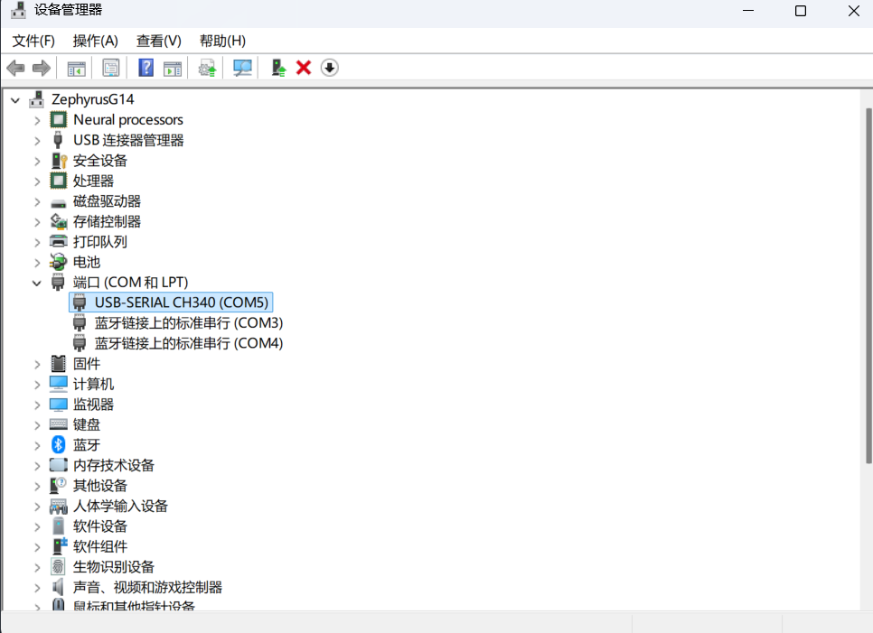
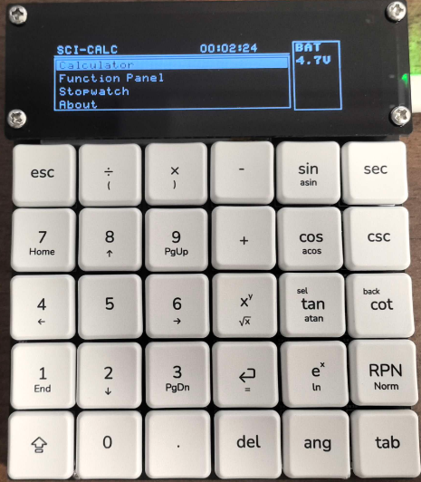
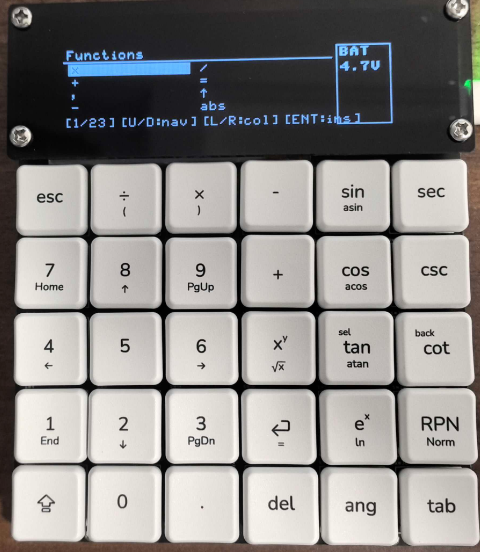
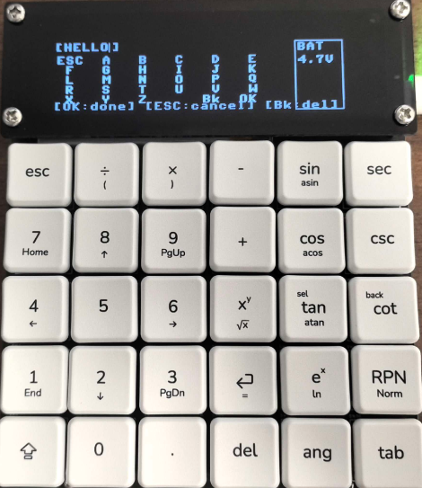
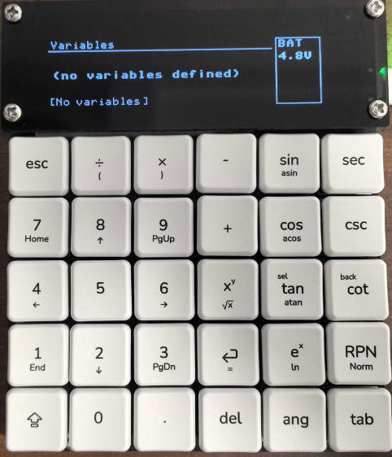
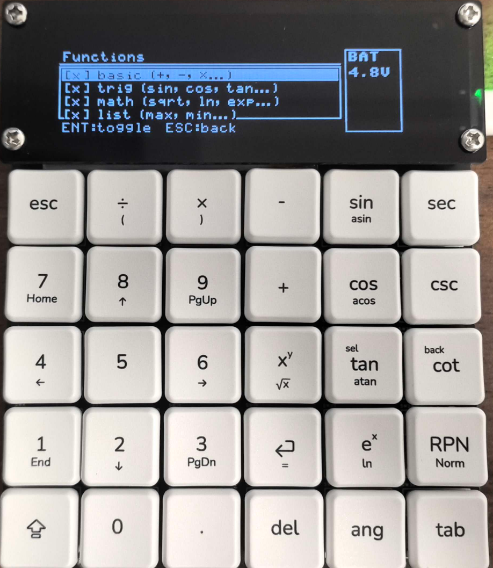
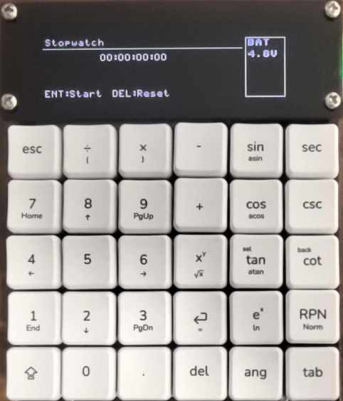

# SCI-CALC MicroPython Edition

基于 [SCI-CALC](https://github.com/shaoxiongduan/sci-calc) 的，使用MicroPython实现计算功能的固件。

**完全使用Deepseek-v4-Pro编写，不保证功能正常**。

## 安装

### 1. 安装 esptool 和 mpremote

```bash
pip install esptool mpremote
```

### 2. 刷写 MicroPython 固件

从 [micropython.org/download/ESP32_GENERIC](https://micropython.org/download/ESP32_GENERIC) 下载 `.bin`。

```bash
# 擦除
esptool.py --port COM5 --baud 460800 erase_flash

# 刷入（替换为实际文件名）
esptool.py --port COM5 --baud 460800 write_flash 0x1000 ESP32_GENERIC-20240602-v1.23.0.bin
```
COM5应当替换为你的串口，使用设备管理器查看，后面同。


### 3. 写入 boot.py

从这里往后都需要切换命令行目录到 ./source 。

将 `internal_boot.py` 写入内部 Flash 作为开机自启脚本：

```bash
cd mp_version
mpremote connect COM5 fs cp internal_boot.py :/boot.py
```

此脚本开机自动挂载 SD 卡并启动 `main.py`。无 SD 卡时回退到内部 Flash。

### 4. 上传项目文件到SD卡

```bash
cd mp_version # 如果上文执行过了就不需要执行
mpremote connect COM5 fs cp main.py :/main.py
mpremote connect COM5 fs cp settings.json :/settings.json
mpremote connect COM5 fs cp vars.json :/vars.json

# 目录
mpremote connect COM5 fs cp display/ssd1322.py :/display/ssd1322.py
mpremote connect COM5 fs cp display/xglcd_font.py :/display/xglcd_font.py
mpremote connect COM5 fs cp display/mono_palette.py :/display/mono_palette.py
mpremote connect COM5 fs cp display/__init__.py :/display/__init__.py

mpremote connect COM5 fs cp fonts/Bally7x9.c :/fonts/Bally7x9.c
mpremote connect COM5 fs cp fonts/Neato5x7.c :/fonts/Neato5x7.c
mpremote connect COM5 fs cp fonts/FixedFont5x8.c :/fonts/FixedFont5x8.c

mpremote connect COM5 fs cp ui/element.py :/ui/element.py
mpremote connect COM5 fs cp ui/cursor.py :/ui/cursor.py
mpremote connect COM5 fs cp ui/inputbox.py :/ui/inputbox.py
mpremote connect COM5 fs cp ui/menu.py :/ui/menu.py
mpremote connect COM5 fs cp ui/text.py :/ui/text.py
mpremote connect COM5 fs cp ui/checkbox.py :/ui/checkbox.py
mpremote connect COM5 fs cp ui/__init__.py :/ui/__init__.py

mpremote connect COM5 fs cp anim/engine.py :/anim/engine.py
mpremote connect COM5 fs cp anim/__init__.py :/anim/__init__.py

mpremote connect COM5 fs cp calc/functions.py :/calc/functions.py
mpremote connect COM5 fs cp calc/parser.py :/calc/parser.py
mpremote connect COM5 fs cp calc/loader.py :/calc/loader.py
mpremote connect COM5 fs cp calc/__init__.py :/calc/__init__.py

mpremote connect COM5 fs cp input/keyboard.py :/input/keyboard.py
mpremote connect COM5 fs cp input/__init__.py :/input/__init__.py

mpremote connect COM5 fs cp screens/main_menu.py :/screens/main_menu.py
mpremote connect COM5 fs cp screens/calculator.py :/screens/calculator.py
mpremote connect COM5 fs cp screens/function_panel.py :/screens/function_panel.py
mpremote connect COM5 fs cp screens/function_picker.py :/screens/function_picker.py
mpremote connect COM5 fs cp screens/letter_panel.py :/screens/letter_panel.py
mpremote connect COM5 fs cp screens/variable_panel.py :/screens/variable_panel.py
mpremote connect COM5 fs cp screens/stopwatch.py :/screens/stopwatch.py
mpremote connect COM5 fs cp screens/about.py :/screens/about.py
mpremote connect COM5 fs cp screens/__init__.py :/screens/__init__.py

mpremote connect COM5 fs cp utils/storage.py :/utils/storage.py
mpremote connect COM5 fs cp utils/__init__.py :/utils/__init__.py

mpremote connect COM5 fs cp functions/basic.py :/functions/basic.py
mpremote connect COM5 fs cp functions/trig.py :/functions/trig.py
```

### 5. 复位启动

```bash
mpremote connect COM5 reset
```

看到进度条即安装成功。

---

## 界面

### 主菜单

上下键选择，ENT 进入，ESC 无操作。



### 计算器

一行输入，ENT 求值，历史 4 行可滚动。

原谅我改了改RPN按键的用法。

| 按键 | 功能 |
|---|---|
| **Tab** | 切换历史记录 |
| **Shift+Tab** | 打开变量表 |
| **RPN** | 打开函数选择器（快速插入函数） |
| **Shift+RPN** | 打开字母面板（输入变量名 A-Z） |

#### 历史记录

Tab 进入后：
- **上/下**：滚动选择
- **ENT**：追加选中结果的**值**到输入行
- **左/右**（物理 4/6 键）：追加选中**表达式**到输入行
- **Tab / ESC**：退出历史模式

### 函数选择器 (RPN)

列出所有已加载的函数，双列 8 项可见，整页翻动。



- **ENT**：插入选中函数（prefix/list 类自动加 `(`）
- **上/下**：导航
- **4/6 键**：左右跳列
- **ESC**：关闭

### 字母面板 (Shift+RPN)

默认大写。按 **Sh** 键切换大小写，可输入小写字母（`pi`、`e`、变量名）。分号 `;` 支持多语句。



- **Sh**：切换大小写（`ABC` ↔ `abc`），默认大写
- **OK**：写入已输入内容到计算器，关闭
- **ESC**：取消不写入
- **Bk**：退格
- **`;`**：分号，多语句分隔

### 变量表 (Shift+Tab)

双列表格，显示所有已定义变量。



- **ENT**：插入变量名到输入行
- **DEL**：删除选中变量
- **左/右**（4/6 键）：跳列
- **ESC**：关闭

### 函数面板

主菜单进入。开关内置函数组和 SD 卡函数文件。



- **ENT**：切换启用/禁用
- **ESC**：保存并退出，自动重载函数表

### 秒表


- **ENT**：开始 / 暂停
- **DEL**：计圈 / 复位
- **ESC**：返回

### About

显示版本和硬件信息，ESC 返回。

---

## 设计思路

除了括号 `()` 和分号 `;` 外，我把所有运算符都做成插件形式。

### 1. 函数定义：6 元组

每个运算符由 6 个字段描述，统一存在 `func_table` 字典里：

```python
# (name, priority, kind, arity, associativity, callable)
BUILTIN_FUNCTIONS = {
    "+":   ("+",   1, "infix",  0, "left",  add_func),
    "-":   ("-",   1, "infix",  0, "left",  sub_func),
    "^":   ("^",   3, "infix",  0, "right", pow_func),
    "sin": ("sin", 4, "prefix", 0, None,    sin_func),
    "max": ("max", 4, "list",   0, None,    max_func),
}
```

| 字段 | 含义 |
|---|---|
| `name` | 表达式中的触发名，也是字典键 |
| `priority` | 优先级，越大越先计算。`=` 和 `,` 为 0（最低），三角函数为 4（最高） |
| `kind` | `"infix"` 中缀 `a+b` / `"prefix"` 前缀 `sin 30` / `"list"` 多参 `max(3,5)` / `"postfix"` 后缀 |
| `arity` | 仅 list 型使用，最少参数个数 |
| `associativity` | 仅 infix 型使用，`"left"` 左结合 / `"right"` 右结合（如 `^`） |
| `callable` | Python 函数，签名 `func(args..., vars_dict) → (result, vars_dict)` |

### 2. 函数签名约定

所有函数接收参数 + 变量字典，**返回 `(结果, 变量字典)` 元组**。如果想要修改变量，只需要修改变量字典并返回就行。

```python
# 中缀: a + b
def add_func(a, b, vars):
    if a is None:           # 处理一元情况
        return b, vars
    return a + b, vars

# 前缀: sin(30)
def sin_func(a, vars):
    import math
    return math.sin(math.radians(a) if ANGLE_MODE else a), vars

# 赋值: x = 5（a 是变量名字符串，不求值）
def assign_func(a, b, vars):
    vars[a] = b
    return b, vars

# 多参列表: max(3, 5, 7)
def max_func(args, vars):
    return max(args), vars
```

`-` 的一元处理：当 `-` 前没有操作数时（表达式开头或 `(` 之后），左操作数传入 `None`，`sub_func(None, b)` → `-b`。`-` 始终是同一个 infix 函数，不存在"一元减号"这个特殊 Token。

### 3. 解析器：Pratt 算法

使用 **Pratt 解析器**（递归下降 + 优先级攀爬）。核心在 `_parse_expr()`：

```python
def _parse_expr(tokens, pos, vars, func_table, min_prec):
    # NUD: 解析前缀——数字、变量、括号、前缀函数
    pos, left, vars = _parse_prefix(tokens, pos, vars, func_table)

    # LED: 只要下一个运算符优先级够高，就继续绑定
    while pos < len(tokens):
        op_char = tokens[pos][1]
        op_def = func_table.get(op_char)  # 从函数表动态查找
        if op_def is None:
            raise ParseError(f"Unknown operator: '{op_char}'")

        _, prio, kind, assoc, _, func = op_def
        if prio < min_prec: break         # 优先级不够，停止

        if kind == "infix":
            pos += 1
            next_min = prio + 1 if assoc == "left" else prio
            pos, right, vars = _parse_expr(tokens, pos, vars, func_table, next_min)
            left, vars = func(left, right, vars)  # 动态调用
        elif kind == "prefix":
            pos += 1
            pos, arg, vars = _parse_expr(tokens, pos, vars, func_table, prio)
            left, vars = func(arg, vars)           # 动态调用
```

以 `2 + 3 * 4` 为例：

```
_parse_expr(min_prec=0)
  NUD → 2
  LED: +, prio=1 ≥ 0 → 右半部 _parse_expr(min_prec=2)
    NUD → 3
    LED: *, prio=2 ≥ 2 → 右半部 _parse_expr(min_prec=3)
      NUD → 4
    ← mul_func(3, 4) → 12
  ← add_func(2, 12) → 14
```

结合性：`-` 左结合，`next_min = prio + 1`，`a - b - c` → `(a - b) - c`。`^` 右结合，`next_min = prio`，`a ^ b ^ c` → `a ^ (b ^ c)`。

### 4. 函数组与动态开关

内置函数按类型分组：

```python
FUNCTION_GROUPS = {
    "basic": ["+", "-", "*", "/", "^", "=", ","],
    "trig":  ["sin", "cos", "tan", "asin", "acos", "atan", "sec", "csc", "cot"],
    "math":  ["sqrt", "ln", "exp", "log", "abs"],
    "list":  ["max", "min"],
}
```

`build_func_table(enabled_groups)` 根据启用组**选择性组装**函数表。关闭 "trig" → `sin` 不在表中 → 解析器报 `Unknown operator`。不是隐藏——函数真的不存在。

### 5. SD 卡热扩展

`/sd/functions/*.py` 实现 `flist()` 返回 6 元组列表：

```python
# /sd/functions/my_stats.py
def flist():
    return [("avg", 4, "list", 0, None, avg_func)]
def avg_func(args, vars):
    return sum(args) / len(args), vars
```

系统 import → 调 `flist()` → 合并到 `func_table`。同名冲突：后加载覆盖。函数面板可开关——关闭后下次重载不再导入。

### 6. 为什么这样做

这是之前我闲的没事想出来的一个计算器实现思路，如今有空就用LLM实现了一遍。

解析器只管语法（括号、优先级、结合性），具体运算全部委托给函数表。

函数表是运行时可变的字典，函数面板即时生效、SD 卡热加载、RPN 面板列出所有函数可选，都源于这个架构。

---

## 表达式语法

```
# 基本运算
2 + 3 * 4          → 14
(2 + 3) * 4        → 20
2^8                → 256
-5                 → -5

# 函数（括号可选）
sin(30)            → 0.5 (DEG)
sin 30             → 同上
sqrt(16)           → 4.0

# 多参数
max(3, 5, 7)       → 7
min(3, 5, 7)       → 3

# 变量赋值
x = 5              → 5
x + 3              → 8

# 多语句（分号分隔）
x = 5; y = 3; x + y → 8

# 一些常数
pi                  → 3.141593
```

### 内置函数组

| 组 | 函数 |
|---|---|
| **basic** | `+` `-` `*` `/` `^` `=` `,` |
| **trig** | `sin` `cos` `tan` `asin` `acos` `atan` `sec` `csc` `cot` |
| **math** | `sqrt` `ln` `exp` `log` `abs` |
| **list** | `max` `min` |

### SD 卡扩展函数

将 `.py` 文件放入 `/sd/functions/`，实现 `flist()` 返回函数定义即可。自带：

- `basic.py` — 基础运算符（模运算 `%` 示例）
- `trig.py` — 双曲函数 `sinh/cosh/tanh`、角度制 `sind/cosd/tand`、常量 `PI()`

---

## 代码结构

```
mp_version/
├── main.py                    # 入口：硬件初始化→开机动画→主循环
├── boot.py                    # 启动脚本：挂载 SD 卡
├── settings.json              # 持久化设置（默认值）
├── vars.json                  # 持久化变量表（默认空）
│
├── display/
│   ├── ssd1322.py             # SSD1322 OLED 驱动（SPI, 256×64, 4-bit灰度）
│   ├── xglcd_font.py          # XGLCD 字体加载器（含字母缓存+字符串缓存）
│   └── mono_palette.py        # 单色→灰度调色板
│
├── ui/
│   ├── element.py             # UIElement 基类（位置/尺寸/动画目标）
│   ├── cursor.py              # 光标组件（线/框模式，动画过渡）
│   ├── inputbox.py            # 单行输入框（光标、滚动、DEL长按）
│   ├── menu.py                # 滚动菜单列表（预截断、动画高亮）
│   ├── text.py                # 文本标签
│   └── checkbox.py            # 复选框（动画勾选）
│
├── anim/
│   └── engine.py              # 动画引擎（INDENT/BOUNCE/LINEAR 缓动，全局注册表）
│
├── calc/
│   ├── parser.py              # Pratt 解析器（递归下降+优先级，含位置追踪）
│   ├── functions.py           # 内置函数表 + 函数组装建器
│   └── loader.py              # SD 卡函数文件加载器
│
├── input/
│   └── keyboard.py            # 5×6 矩阵键盘扫描（防抖+状态机+键位映射）
│
├── screens/
│   ├── main_menu.py           # 主菜单
│   ├── calculator.py          # 计算器（输入+历史+错误弹窗）
│   ├── function_panel.py      # 函数开关面板（内置组+SD文件）
│   ├── function_picker.py     # 函数选择器（Shift+RPN, 双列翻页）
│   ├── letter_panel.py        # 字母面板（RPN, A-Z大写）
│   ├── variable_panel.py      # 变量表（Shift+Tab, 双列）
│   ├── stopwatch.py           # 秒表
│   └── about.py               # 关于页
│
├── utils/
│   └── storage.py             # JSON 读写（内存缓存+SD/内部Flash自动检测）
│
├── functions/
│   ├── basic.py               # SD 卡函数示例：% 取模
│   └── trig.py                # SD 卡函数：sinh/cosh/tanh/sind/cosd/tand/PI
│
├── fonts/
│   ├── Bally7x9.c             # 主字体 7×9 比例
│   ├── Neato5x7.c             # 小字体 5×7 比例
│   └── FixedFont5x8.c         # 备用等宽字体
│
├── test_parser.py             # 解析器单元测试
├── README.md
└── INSTALL.md
```

### 主循环流程

```
while True:
    kb.scan()                   # 扫描键盘矩阵（15ms间隔）
    animate_all()               # 驱动所有动画
    current_screen.update(kb)   # 当前界面逻辑
    current_screen.draw()       # 渲染（15fps限速）
    draw_sidebar()              # 电池电压
    display.present()           # SPI 全帧输出（16MHz, ~4ms）
    handle screen switching     # BACK / FUNC_PANEL_DONE / etc.
    handle global hotkeys       # ang / Shift+RPN
```

### 性能优化

| 优化 | 说明 |
|---|---|
| 字母缓存 | `XglcdFont` 缓存已渲染的字符 `FrameBuffer` |
| 字符串缓存 | 整句渲染结果缓存为 `FrameBuffer`，1 blit 代替 N blit |
| 间距跳过 | 黑底黑字时 `fill_rectangle` 间距为无操作，直接跳过 |
| 帧率限速 | 15fps 渲染限速，无输入时大幅降低 CPU 和 SPI 负载 |
| GC 间歇 | `gc.collect()` 每 100 帧一次（~1 秒） |
| ADC 缓存 | 电池电压 500ms 读一次 |
| 菜单预截断 | `add_item` 时截断标签，不每帧重算 |